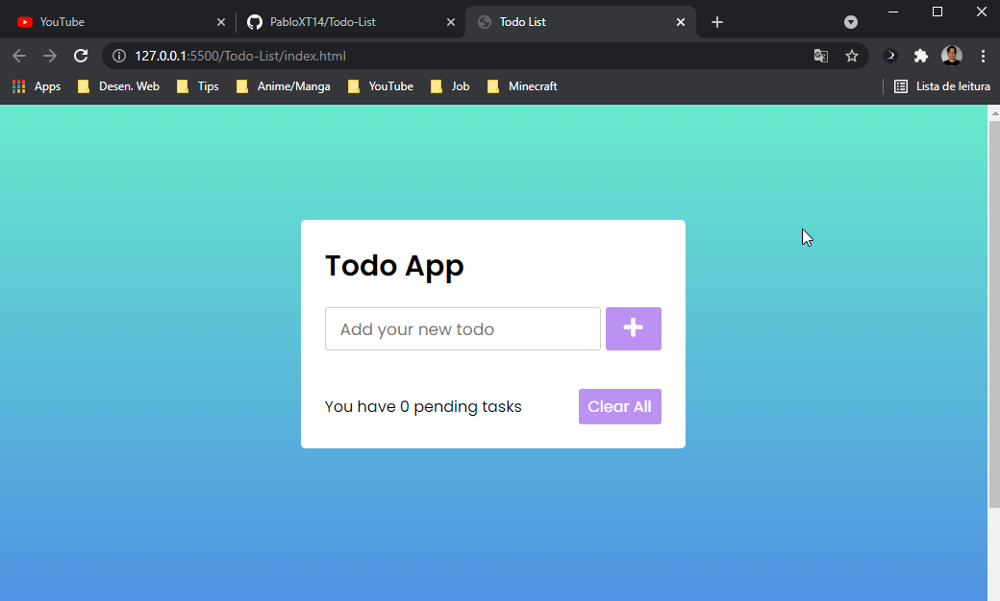

# Todo List
Projeto App Todo List([conteúdo de referência](https://www.youtube.com/watch?v=ykuD2QOZkhc&t=1513s)) feito com HTML, CSS e Javascript, com o objetivo de treinar e aprimorar habilidades em CSS e Javascript, mais especificamente em utilizar o mecanismo de armazenagem LocalStorage dos browsers.

## 📷 Demonstration
 

## 🚀 Technologies
✔ HTML
 
✔ CSS
 
✔ Javascript
 
✔ LocalStorage
  
✔ IDE: VS Code

## ⚙ Settings
* Para executar o projeto basta rodar o arquivo index em algum browser
* Ou acessar: https://pabloxt14.github.io/Stopwatch/
* Obs: a página está responsiva, então pode executá-la até mesmo no celular
